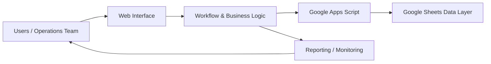

# Operations CRM & Workflow Platform — Case Study

## Executive summary

A custom operations CRM and workflow platform designed to bring customer records, work queues, follow-ups, team coordination and reporting into a more structured operating environment.

The project demonstrates a core part of how I work: start with the operating problem, map the workflow, identify the information and control points that matter, then turn that model into a usable system.

## The operating problem

Operational teams often lose time and accountability when:

- records are fragmented across multiple tools or sheets;
- ownership of the next action is unclear;
- follow-ups are tracked manually;
- managers cannot quickly see workload, exceptions or progress;
- reporting requires repeated manual consolidation.

The goal was therefore not simply to create a database. It was to create an operating layer that connects records, actions, ownership and management visibility.

## My contribution

I led the:

- workflow and information-structure design;
- operating requirements translation;
- interface direction;
- system implementation;
- workflow automation;
- reporting and monitoring structure;
- iteration based on operational usage.

This work reflects both product thinking and operational ownership: the system was designed around how teams actually work rather than around technology for its own sake.

## Capability map

| Capability | Purpose |
|---|---|
| Customer / record management | Keep operational information structured and accessible |
| Workflow tracking | Make next actions and status visible |
| Team coordination | Connect work to ownership and execution |
| Reporting | Give managers a clearer operational picture |
| Exception handling | Surface cases that need intervention |
| Process discipline | Reduce reliance on fragmented manual tracking |

## High-level architecture

The public case study describes the architecture at a high level. Production implementation details are intentionally omitted where they belong to a live business environment.

## Design principles

### 1. Workflow before screens

The system begins with the work that needs to happen: records, status, ownership, handoffs, follow-ups and exceptions.

### 2. Visibility at the point of action

Important status and ownership information should be visible where the user is working, rather than requiring a separate reporting exercise.

### 3. Automation where it removes repetitive work

Automation is used to reduce manual handling while preserving the information and controls needed for accountable operations.

### 4. Reporting that supports decisions

Management reporting should answer practical questions such as what is pending, what is overdue, what needs escalation and where execution is slowing.

## Technology

- HTML
- CSS
- JavaScript
- Google Apps Script
- Google Sheets
- PHP

## Public evidence

The repository includes interface screenshots showing the system's operational experience. They are presented as evidence of the product and workflow design, not as a disclosure of production source code.

## Confidentiality boundary

Production code is private because the system is connected to a live business environment. This public repository intentionally avoids:

- credentials and secrets;
- live customer information;
- proprietary configuration;
- production-only business rules;
- sensitive operational data.

## What this project demonstrates

This is a practical example of:

**operations problem → workflow model → product design → automation → reporting → operating discipline**

That combination is representative of the broader work I do across operations, product execution and digital systems.

---

[Back to my portfolio](https://Nandwa254.github.io/)
